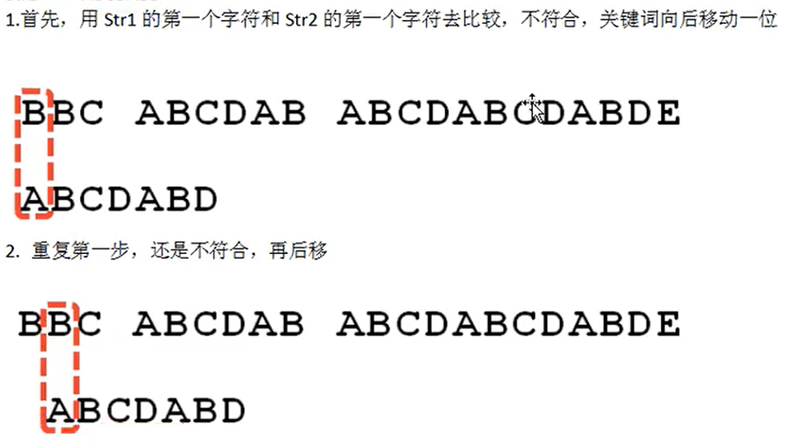
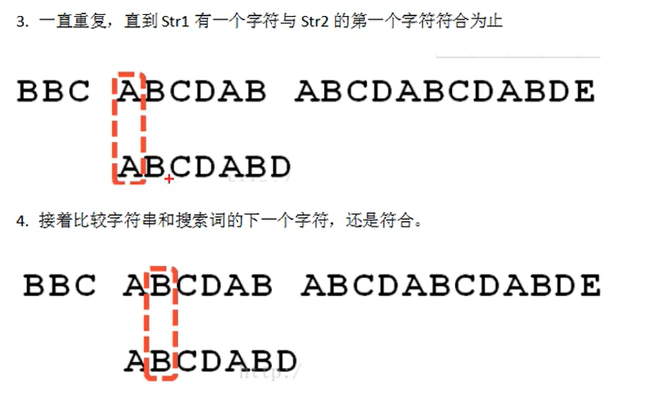
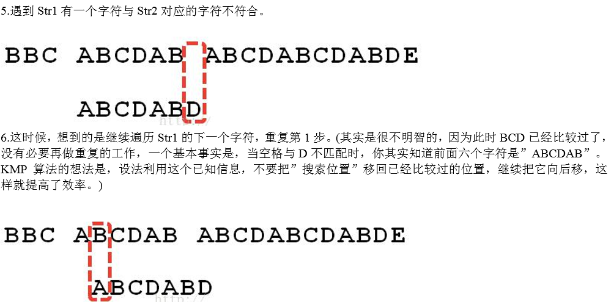
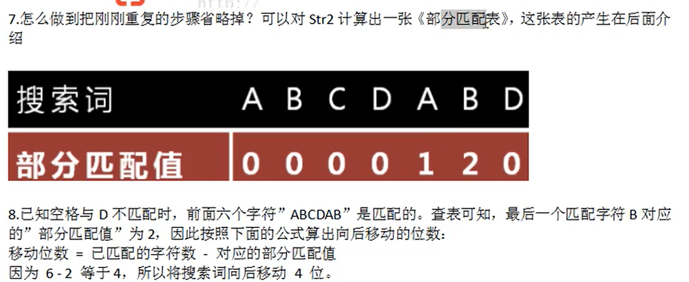
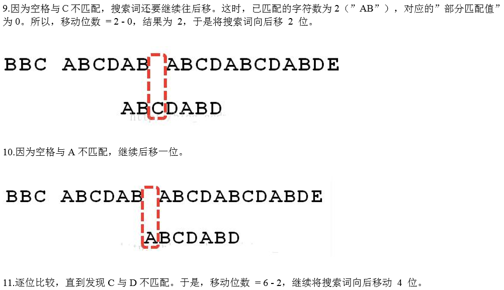
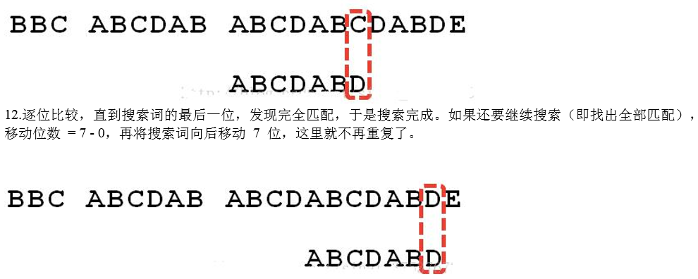
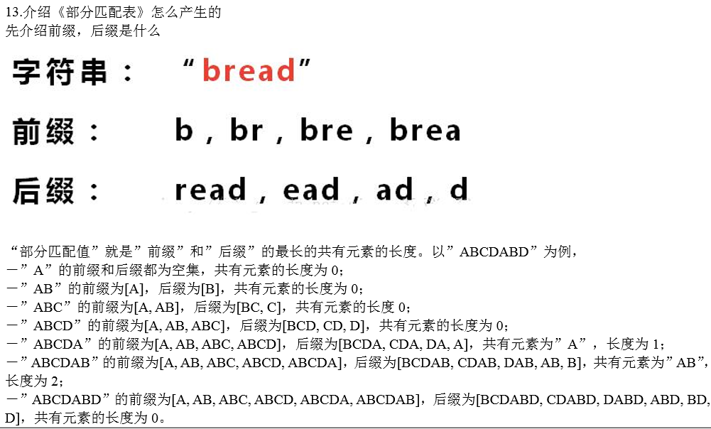
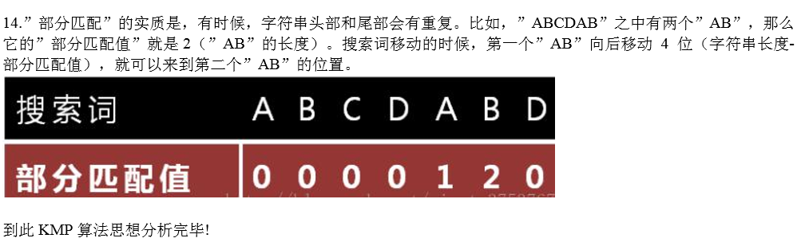

## KMP算法

### 应用场景-字符串匹配问题

1. 有一个字符串str1=“我我我我我 爱你 你你你 我喜欢你我最最喜欢你” ，和一个子串str2=“我喜欢你我”
2. 现在要判断str1是否含有str2，如果存在，就返回第一次出现的位置，如果没有，则返回-1

### 暴力匹配算法

如果用暴力匹配的思路，并假设现在在str1匹配到i的位置，子串str2匹配到j的位置，则有：

1. 如果当前字符匹配成功（即str[ i ] == str[ j ]）,则i++，j++，继续匹配下一个字符

2. 如果失配（即str[ i ] != str[ j ]），令i = i - (j - 1)，j = 0。相当于每次匹配失败时，i 回溯，j被重置0

3. 用暴力方法解决的话就会有大量的回溯，每次只移动一位，若是不匹配，移动到下一位接着判断，浪费了大量时间。（不可行）

4. 暴力匹配算法实现

   ```java
   package kmp;
   
   public class ViolentMatch {
       public static void main(String[] args){
           String str1 = "我我我我我 爱你 你你你 我喜欢你我最最喜欢你";
           String str2 = "我喜欢你我";
           int i = violentMatch(str1.toCharArray(),str2.toCharArray());
           if (i != -1){
               System.out.println("找到首字"+i);
           }
       }
   
       //暴力匹配算法的实现
       public static int violentMatch(char[] str1,char[] str2){
           int i = 0,j = 0;
           while (i < str1.length && j <str2.length){
               if (str1[i] == str2[j]){
                   i++;
                   j++;
               }else {
                   i = i - j + 1;
                   j = 0;
               }
           }
           if (j == str2.length){
               return i - j;
           }else {
               return -1;
           }
       }
   }
   
   ```


### KMP算法

#### 基本介绍

1. kmp是一个解决模式串在文本串是否出现过，如果出现过，最早出现的位置的经典算法
2. Knuth-Morris-Pratt字符串查找算法，简称KMP算法，常用于在一个文本串s内查找一个模式串P的出现位置，这个算法是由Donald Knuth、Vaughan Pratt、James H.Morris三人于1977年联合发表，故取这三人的姓氏命名此算法
3. KMP方法就利用之前判断过信息，通过一个next数组，保存模式串前后最长公共子序列的长度，每次回溯时，通过next数组找到，前面匹配过得位置，省去大量计算时间。

#### KMP算法最佳应用-字符串匹配问题

1. 有一个字符串 str1=“BBC ABCDAB ABCDABCDABDE”，和一个子串str2=“ABCDABD”
2. 现在要判断str1是否含有str2，如果存在，就返回第一次出现的位置，如果没有就返回-1
3. 要求：使用KMP算法完成判断，不能使用暴力求解

思路解析：


















#### 代码实现

```java
package kmp;

public class KMPAlgorithm {
    public static void main(String[] args){
        String str1 = "BBC ABCDAB ABCDABCDABDE";
        String str2 = "ABCDABD";
        int[] next = kmpNext(str2);
        int num = kmpSearch(str1,str2,next);
        if (num != -1){
            System.out.println("匹配得到index："+ num);
        }else {
            System.out.println("未找到");
        }
    }

    public static int kmpSearch(String str1,String str2,int[] next){
        for (int i = 0,j = 0; i < str1.length(); i++) {
            while (j > 0 && str1.charAt(i) != str2.charAt(j)){
                j = next[j - 1];
            }
            if (str1.charAt(i) == str2.charAt(j)){
                j++;
            }
            if (j == str2.length()){
                return i - j + 1;
            }
        }
        return -1;
    }
    /**
     * 获取字符串的部分匹配表，前缀数组和后缀数组进行比较有无相同子串，匹配值为相同的个数，为最长公共前后缀
     * @param dest
     * @return
     */
    public static int[] kmpNext(String dest){
        int[] next = new int[dest.length()];
        next[0] = 0;//只有一个前缀或者后缀，匹配值就为0
        for (int i = 1,j = 0; i < dest.length(); i++) {
            //kmp算法核心点，向前比较，
            while (j > 0 && dest.charAt(i) != dest.charAt(j)){
                j = next[j - 1];
            }
            //匹配值+1,检测公共前后缀
            if (dest.charAt(i) == dest.charAt(j)){
                j++;
            }
            next[i] = j;
        }
        return next;
    }
}

```

