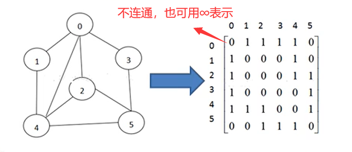

## 图

### 图的基本介绍

为什么要有图？

1. 前面我们学了线性表和树
2. 线性表局限于一个直接前驱和一个直接后继的关系
3. 树也只能有一个直接前驱也就是父节点
4. 当我们需要表示多对多的关系时，这里我们就用到了图。

图的举例说明

图是一种数据结构，其中节点可以具有零个或多个相邻元素。两个节点之间的连接称为边。节点也称为顶点。


图的基本概念

1. 顶点（vertex）

2. 边（edge）

3. 路径

4. 无向图

   

5. 有向图

6. 带权图

   

### 图的表示方式

图的表示方式有两种：二维数组表示（邻接矩阵）；链表表示（邻接表）。

***邻接矩阵***

邻接矩阵是表示图形中顶点之间相邻关系的矩阵，对于n个顶点的图来说，矩阵是row和col表示的1……n个点。



***邻接表***

1. 邻接矩阵需要为每个顶点都分配n个边的空间，其实有很多都是不存在的，会造成空间的一定损失。

2. 邻接表的实现只关心存在的边，不关心不存在的边，因此没有浪费空间，邻接表由数组+链表组成。

   

### 图的入门案例

1. 要求实现：

   

2. 思路分析

   1. 存储顶点：ArrayList
   2. 保存矩阵：二维数组 int[][] edges

3.  代码实现

   ```java
   package graph;
   
   import java.util.ArrayList;
   import java.util.Arrays;
   
   public class Graph {
   
       public static void main(String[] args){
           //测试
           String Vertexs[] = {"A","B","C","D","E"};
           Graph graph = new Graph(Vertexs.length);
           //添加顶点
           for (String vertex : Vertexs) {
               graph.insertVertex(vertex);
           }
           //添加边
           graph.insertEdge(0,1,1);
           graph.insertEdge(0,2,1);
           graph.insertEdge(1,2,1);
           graph.insertEdge(1,3,1);
           graph.insertEdge(1,4,1);
           graph.showGraph();
       }
   
       /**
        * vertexList 存储顶点的集合
        * edges 存储图对应的邻接矩阵
        * numOfEdges 表示边的个数
        */
       private ArrayList<String> vertexList;
       private int [][] edges;
       private int numOfEdges;
   
       /**
        * 构造器
        * 初始化矩阵和顶点集合
        */
       public Graph(int n) {
           edges = new int[n][n];
           vertexList = new ArrayList<>(n);
       }
   
       //显示图所对应的矩阵
       public void showGraph(){
           for (int [] link : edges) {
               System.out.println(Arrays.toString(link));
           }
       }
   
       //返回节点的个数
       public int getNumOfVertex(){
           return vertexList.size();
       }
   
       //得到边的数目
       public int getNumOfEdges(){
           return numOfEdges;
       }
   
       //返回节点i对应的值
       public String getValueByIndex(int i){
           return vertexList.get(i);
       }
   
       //返回v1和v2的权值
       public int getWeight(int v1,int v2){
           return edges[v1][v2];
       }
   
       //插入顶点
       public void insertVertex(String verTex){
           vertexList.add(verTex);
       }
   
       /**
        * 添加边
        * @param v1 表示第一个点的下标即第几个顶点
        * @param v2
        * @param weight 0：不连通   1：连通
        */
       public void insertEdge(int v1,int v2, int weight){
           edges[v1][v2] = weight;
           edges[v2][v1] = weight;
           numOfEdges++;
       }
   }
   
   ```

### 图的遍历

所谓图的遍历，即是对节点的访问。一个图有那么多个节点，如何遍历这些节点，需要特定策略，一般有两种访问策略：1）深度优先遍历；2）广度优先遍历

#### 图的深度优先遍历介绍

基本思想：（图的深度优先搜索（Depth First Serch））

1. 深度优先遍历，从初始访问节点出发，初始访问节点可能有多个邻接节点，深度优先遍历的策略就是首先访问第一个邻接节点，然后再以这个被访问的邻接节点作为初始节点，访问它的第一个邻接节点，可以这样理解：每次都在访问完当前节点后首先访问当前节点的第一个邻接节点
2. 我们可以看到，这样的访问策略是优先往纵向挖掘深入，而不是对一个节点的所有邻接节点进行横向访问。
3. 显然，深度优先搜索是一个递归过程。

深度优先遍历算法步骤

1. 访问初始节点v，并标记节点v已经被访问
2. 查找节点v的第一个邻接节点w
3. 若w存在，则继续执行4，如果w不存在，则回到第1步，将从v的下一节点继续。
4. 若w未被访问，对w进行深度优先遍历递归（即把w当做另一个v，然后执行步骤123）
5. 查找节点v的w邻接节点的下一个临界点，转到步骤3

#### 图的广度优先遍历

基本思想：

图的广度优先搜索（Broad First Serach）

类似于一个分层搜索的过程，广度优先遍历需要使用一个队列以保持访问过的节点的顺序，以便按这个顺序来访问这些节点的邻接节点。

广度优先遍历算法步骤

1. 访问初始节点v并标记节点v已访问
2. 节点v入队列
3. 当队列非空时，继续执行，否则算法结束
4. 出队列时，取得对头节点
5. 查找节点u的第一个邻接节点w
6. 若节点u的邻接节点w不存在，则转到步骤3；否则循环执行以下三个步骤：
   1. 若节点w尚未被访问，则访问节点w并标记为已访问
   2. 节点w入队列
   3. 查找节点u的继w邻接节点后的下一个邻接节点w，转到步骤6.

#### 深度优先VS广度优先


