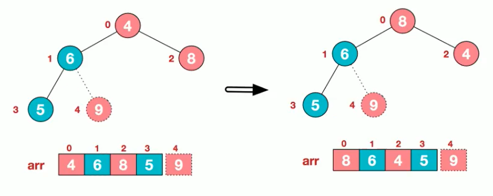

## 堆排序

1. 基本介绍

   - 堆排序是利用堆这种数据结构而设计的一种排序算法，堆排序是一种选择排序，他的最坏，最好，平均复杂度都是O(nlogn)，他也是不稳定排序
   - 堆是具有以下性质的完全二叉树：每个节点的值都大于或等于其左右孩子节点的值，称为大顶堆，注意：没有要求节点的左孩子的值和右孩子的值的大小关系。
   - 每个节点的值都小于或等于其左右孩子节点的值，称为小顶堆
   - 大顶堆举例说明

   

   

2. 基本思想

   - 将待排序序列构造成一个大顶堆(为数组，逻辑上的树)

   - 此时，整个序列的最大值就是堆顶的根节点

   - 将其与末尾进行交换，此时末尾就是最大值

   - 然后将剩余n-1个元素重新构造成一个堆，这样会得到n个元素的次小值。如此反复执行，就能够得到一个有序序列。

     - 给定无序序列结构arr={4,6,8,5,9}.

       

     - 从最后一个非叶子节点(叶子结点不用调整，第一个非叶子节点arr.length/2-1=5/2-1=1,arr[1]=6)，从左到右，从下到上。

       

     - 找到第二个非叶子节点4，由于[4,9,8]中9最大，4和9交换

       

     - 这是交换导致了子根[4,5,6]结构混乱，继续调整，[4,5,6]中6最大，交换4和6

       

     - 此时，我们就得到了一个大顶堆

   - 将堆顶元素和末尾元素进行交换，使末尾元素最大。然后继续调整堆，再将堆顶元素与末尾元素进行交换，得到第二大元素。如此类推，反复交换，重建，交换。

     - 将堆顶9和末尾元素4交换

       

     - 重新调整结构，使其满足堆定义

       

     - 再将堆顶元素8和末尾元素5进行交换，得到第二大元素8

       

     - 反复交换，重构，交换

       

3. 总结

   - 将一个无序序列建成一个堆，根据升序降序选择大顶堆或者小顶堆
   - 将堆顶元素和末尾元素进行交换，将最大元素"沉"到数组末端
   - 重新调整结构，使其满足堆定义，然后继续交换堆顶元素与当前末尾元素，反复执行调整+交换步骤，直至整个序列有序。

4. 代码实现

   ```java
   package tree;
   
   import sort.BubbleSort;
   
   import java.text.SimpleDateFormat;
   import java.util.Arrays;
   import java.util.Date;
   
   /*
       堆排序，大顶堆升序，小顶堆降序
    */
   public class HeapSort {
       public static void main(String[] args){
           //要求升序排序的数组
           int[]arr = {4,6,8,5,9};
           heapSort(arr);
   //        int arr[] = new int[800000];
   //        for (int i = 0; i < arr.length; i++) {
   //            arr[i] = (int) (Math.random()*800000);
   //        }
   //        Date date = new Date();
   //        SimpleDateFormat format1 = new SimpleDateFormat("yyyy-MM-dd HH-mm-ss");
   //        System.out.println("排序前的时间"+format1.format(date));
   //        new BubbleSort().getSort(arr);
   //        Date date1 = new Date();
   //        System.out.println("排序后的时间"+format1.format(date1));
   //        heapSort(arr);
       }
   
       //编写堆排序的方法\
   
       /**
        *  先将一个无序数组转换为大顶堆规则的数组
        *  然后从开头开始排值变动堆顶元素和末尾元素，而末尾元素我们不用管，就相当于在堆中只变动了堆顶元素，所以就会造成
        *  堆的最顶部顺序正常，我们就只需要给堆顶元素排到它合适的位置就行
        * @param arr 需要排序的数组
        */
       public static void heapSort(int arr[]){
           System.out.println("这是一个堆排序");
   //        adjustHeap(arr,1,arr.length);
   //        System.out.println("第一次"+ Arrays.toString(arr));
   //        adjustHeap(arr,0,arr.length);
   //        System.out.println("第二次"+ Arrays.toString(arr));
           //完整代码
           for (int i = arr.length/2-1; i >=0 ; i--) {
               adjustHeap(arr,i,arr.length);
           }
           System.out.println("得到大顶堆");
           System.out.println(Arrays.toString(arr));
           /**
            * 将堆顶元素和末尾元素进行交换，将最大元素"沉"到数组末端，length--
            * 重新调整结构，使其满足堆定义，继续交换堆顶与末尾，反复
            */
           //临时变量
           int temp = 0;
           for (int j = arr.length - 1; j > 0; j--) {
               //交换
               temp = arr[j];
               arr[j] = arr[0];
               arr[0] = temp;
               //实际找到堆顶元素
               adjustHeap(arr,0,j);
           }
           System.out.println("大顶堆堆排序结果");
           System.out.println(Arrays.toString(arr));
       }
   
       //将一个数组(二叉树)，调整成大顶堆
   
       /**
        * 功能：完成将以i对应的节点的树调整成大顶堆
        * 举例：int arr[]={4,6,8,5,9};=>i = 1=>adjustHeap=>得到{4,9,8,5,6}
        * 如果我们再次调用传入的i = 0 =>得到{4,9,8,5,6}=>{9,6,8,5,4}
        * @param arr 待调整的数组
        * @param i 表示非叶子节点的在数组中的下标
        * @param length 表示对多少个元素进行减少，沉底时，length在逐渐减少
        */
       public static void adjustHeap(int arr[],int i,int length){
           //先保存当前元素的值
           int temp = arr[i];
           //k表示当前元素的左子节点，只找左子节点
           for (int k = i*2+1; k < length; k = k*2+1) {
               if (k+1 < length && arr[k] < arr[k+1]){//说明左子节点小于右子节点的值
                   k++;//k指向右子节点
               }
               if (arr[k] > temp){//子节点大于父节点，交换位置
                   arr[i] = arr[k];//把较大的值赋给当前节点
                   i = k;//将k指向i,继续循环
               }else {
                   break;
               }
           }
           //当for循环结束后，我们已经将i为父节点的元素放到堆顶(局部)
           arr[i] = temp;//将temp的值放到调整后的位置
       }
   }
   
   ```

   