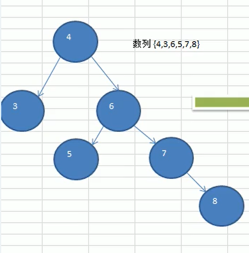
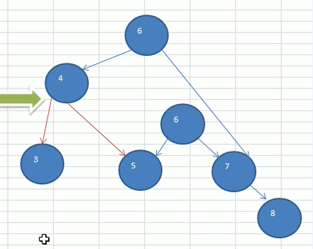
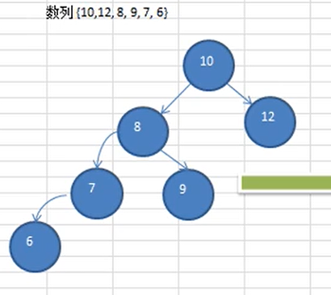
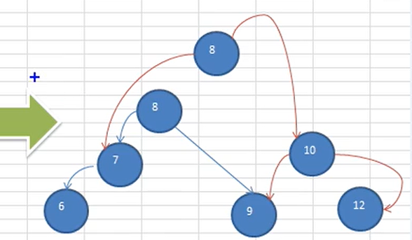
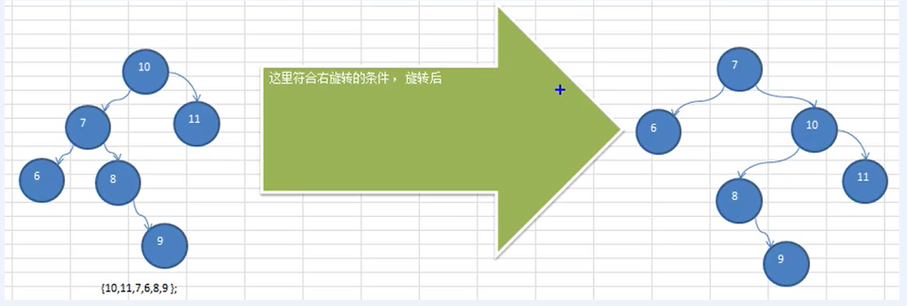

## 平衡二叉树(AVL树)

二叉排序树可能出现的问题

给出一个数列{1,2,3,4,5,6}，要求创建一颗二叉排序树(BST),并分析问题所在

上边BST树存在的问题分析

1. 左子树全部为空，从形式上看，更像一个单链表
2. 插入速度没有影响
3. 查询速度明显降低(因为需求依次比较)，不能发挥出BST的优势，因为每次还需要比较左子树，其查询速度比单链表还慢
4. 解决方案-平衡二叉树(AVL)

### 平衡二叉树(基于二叉排序树)

1. 基本介绍

   1. 平衡二叉树也叫平衡二叉搜索树(Self-balancing binary search tree)又被称为AVL树，可以保证查询效率提高。

   2. 具有以下特点：它是一棵空树或它的左右两个子树的高度差的绝对值不超过1，并且左右两个子树都是一颗平衡二叉树。平衡二叉树的常用实现方法有红黑树、AVL、替罪羊树、Treap、伸展树等。

   3. 举例说明，看看下面哪些AVL树，为什么？

      

2. 应用案例-单旋转(左旋转（右子树高度大于左子树高度）)

   - 要求：创建出对应的平衡二叉树。数列{4,3,6,5,7,8}

   - 思路分析：

      

   - 问题：

     当插入8时，rightHeight()-leftHeight() > 1成立，此时，不再是一颗AVL树了。

   - 处理方式-进行左旋转

     1）创建一个新的节点newNode(以4这个值创建)，创建一个新的节点，值等于当前根节点的值

     2）把新节点的左子树设置了当前节点的左子树

     ​	 newNode.left = left

     3）把新节点的右子树设置为当前节点的右子树的左子树

     ​	 newNode.right = right.left

     4）把当前节点的值换成右子节点的值

     ​	 value = right.value

     5）把当前节点的右子树设置为右子树的右子树

     ​	 right = right.right

     6）把当前节点的左子树设置为新节点

     ​	 left = newLeft
   
3. 右旋转（左子树高度大于右子树高度）

   - 要求：创建出对应的平衡二叉树。数列{10,12,8,9,7,6}

   - 思路分析

     

   - 问题：

     当插入6时，leftHeight - rightHeight > 1成立，此时，不再是一颗AVL树了，怎么处理(进行右旋转)降低左子树的高度，这里将9这个节点，通过右旋转，到右子树

   - 创建一个新的节点newNode(以10这个值创建)，创建一个新的节点，值等于当前根节点的值

   - 把新节点的右子树设置为当前节点的右子树

     newNode.right = right

   - 把新节点的左子树设置为当前节点的左子树的右子树

     newNode.left = left.right

   - 把当前节点的值换为左子节点的值

     value = left.value

   - 把当前节点的左子树设置成左子树的左子树

     left = left.left

   - 把当前节点的右子树设置成新的节点

     right = newNode

4. 双旋转

   1. 问题：{10,11,7,6,8,9}，运行原先代码，未转为AVL树

      

      分析：

      - 进行右旋转时
      - 如果它的左子树的右子树高度大于它的左子树的高度
      - 先对当前这个节点的左节点进行左旋转
      - 再对当前节点进行右旋转

   2. 解决
