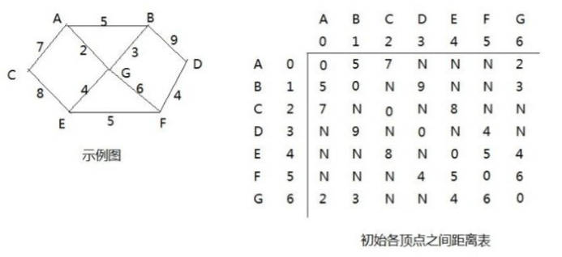
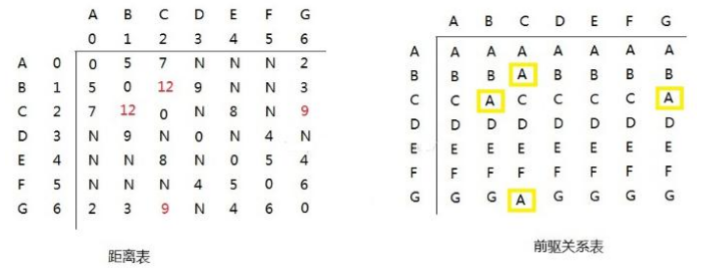
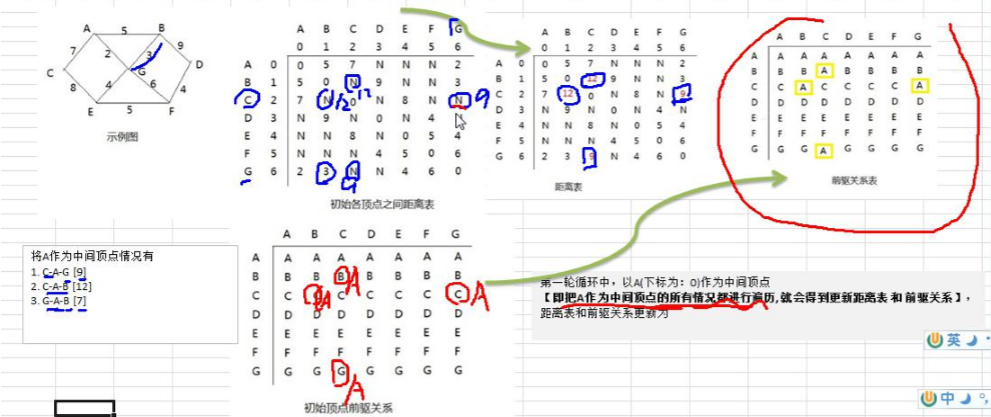
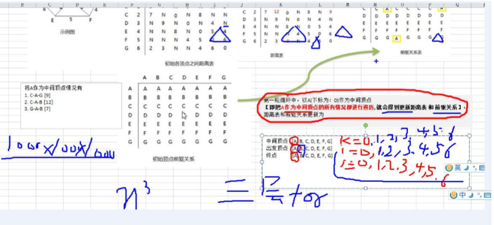

## 弗洛伊德算法

### Floyd算法介绍

1. 和Dijkstra算法一样，弗洛伊德（Floyd）算法也是一种用于寻找给定的加权图中顶点间的最短路径的算法。该算法名称以创始人之一、1978年图灵奖获得者、斯坦福大学计算机科学系教授罗伯特·弗洛伊德命名
2. 弗洛伊德算法计算图中各个顶点之间的最短路径
3. 迪杰斯特拉算法用于计算图中某一顶点到其他顶点的最短路径。
4. 弗洛伊德算法VS迪杰斯特拉算法：迪杰斯特拉算法通过选定的被访问顶点，求出从出发访问顶点到其他顶点的最短路径；弗洛伊德算法的每一个顶点都是出发访问点，所以需要将每一个顶点看作被访问顶点，求出每一个顶点到其他顶点的最短路径

### Floyd算法分析

1. 设置顶点 vi 到顶点 vk 的最短路径已知为 Lik，顶点 vk 到 vj 的最短路径已知为 Lkj，顶点 vi 到 vj 的路径为 Lij， 则 vi 到 vj 的最短路径为：min((Lik+Lkj),Lij)，vk 的取值为图中所有顶点，则可获得 vi 到 vj 的最短路径 
2. 至于 vi 到 vk 的最短路径 Lik 或者 vk 到 vj 的最短路径 Lkj，是以同样的方式获得

### 举例说明




弗洛伊德算法的步骤：

1. 第一轮循环中，以 A(下标为：0)作为中间顶点【即把 A 作为中间顶点的所有情况都进行遍历, 就会得到更新距离表 和 前驱关系】， 距离表和前驱关系更新为：

   

   1.  以 A 顶点作为中间顶点是，B->A->C 的距离由 N->9，同理 C 到 B；C->A->G 的距离由 N->12，同理 G 到 C 

   2.  更换中间顶点，循环执行操作，直到所有顶点都作为中间顶点更新后，计算结束

      

      

### 代码实现

```java
package floyd;

import java.util.Arrays;

/**
 * @program: 数据结构
 * @description: 弗洛伊德算法
 * @author: hjc
 * @create: 2021-06-07 18:45
 **/
public class FloydAlgorithm {
    public static void main(String[] args){
        char [] vertex = {'A','B','C','D','E','F','G'};
        final int N = 65535;
        int[][] matrix = {
                {0,5,7,N,N,N,2},
                {5,0,N,9,N,N,3},
                {7,N,0,N,8,N,N},
                {N,9,N,0,N,4,N},
                {N,N,8,N,0,5,4},
                {N,N,N,4,5,0,6},
                {2,3,N,N,4,6,0}
        };
        Graph graph = new Graph(vertex.length,vertex,matrix);
        graph.floyd();
        graph.show();
    }
}

class Graph{
    private char[] vertex;
    private int[][] distance;
    private int[][] pre;

    /**
     * @description
     * @param length 大小
     * @param vertex 顶点数组
     * @param matrix 邻接矩阵
     * @author hjc
     * CreateDate 2021/6/7 18:54
     */
    public Graph( int length, char[] vertex, int[][] matrix) {
        this.vertex = vertex;
        this.distance = matrix;
        this.pre = new int[length][length];
        //初始化前驱顶点表
        for (int i = 0; i < length; i++) {
            Arrays.fill(pre[i], i);
        }
    }

    //弗洛伊德算法
    public void floyd(){
        //距离
        int len = 0;
        //从中间节点开始遍历,k为vertex的下标
        for (int k = 0; k < distance.length; k++) {
            for (int i = 0; i < distance.length; i++) {
                for (int j = 0; j < distance.length; j++) {
                    //求出从i点出发，经过k中间顶点，到达j的距离
                    len = distance[i][k] + distance[k][j];
                    //如果len小于distance[i][j]
                    if (len < distance[i][j]){
                        //更新距离
                        distance[i][j] = len;
                        //更新前驱
                        pre[i][j] = pre[k][j];
                    }
                }
            }
        }
    }

    //显示distance和pre
    public void show(){

        for (int i = 0; i < distance.length; i++) {
            for (int j = 0; j < distance.length; j++) {
                System.out.print("("+vertex[i]+"到"+vertex[j]+"距离为"+distance[i][j]+") ");
            }
            System.out.println();
        }
//        for (int [] link : distance) {
//            System.out.println(Arrays.toString(link));
//        }
//
        for (int[] link : pre) {
            System.out.println(Arrays.toString(link));
        }
    }
}

```

