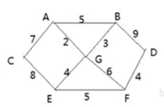
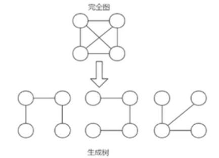

## 普利姆算法

### 应用场景——修路问题



1. 胜利乡有7个村庄（A,B,C,D,E,F,G），现在需要修路把7个村庄连通

2. 各个村庄的距离用边线表示（权），比如A-B距离5公里

3. 闻：如何修路保证各个村庄都能连通，并且总的修建公路总里程最短？

   思路：将10条边，连接即可，但是总的里程数不是最小

   ​			正确的思路，就是尽可能的选择少的路线，并且每条路线最小，保证总里程数最小

### 最小生成树

修路问题本质就是最小生成树问题，先介绍一下最小生成树（Minimum Cost Spanning Tree），简称MST

1. 给定一个带权的无向连通图，如何选取一颗生成树，使树上所有边上权的总和为最小，这叫最小生成树
2. N个顶点，一定有N-1条边
3. 包含全部顶点
4. 举例说明（如图：）
5. 求最小生成树的算法主要是普利姆算法和克鲁斯卡尔算法



### 普利姆算法介绍

1. 普利姆（Prim）算法求最小生成树，也就是在包含n个顶点的连通图中，找出只有（n-1）条边包含所有n个顶点的连通子图，也就是所谓的极小连通子图
2. 普利姆算法如下：
   1. 设G（V,E）是连通网，T(U,D)是最小生成树，V,U是顶点集合，E,D是边的集合
   2. 若从顶点u开始构造最小生成树，则从集合V中取出顶点u放入集合U中，标记顶点v的visited[u] = 1
   3. 若集合U中顶点ui与集合V-U中的顶点vj之间存在边，则寻找这些边中权值最小的边，但不能构成回路，将顶点vj加入集合U中，将边（ui，vj）加入集合D中，标记visited[vj] = 1
   4. 重复步骤②，直到U与V相等，即所有顶点都被标记为访问过，此时D中有n-1条边

### 普利姆算法的图解分析


1. 从<A>顶点开始处理 ======> <A,G> 2

   A-C [7] **A-G[2]** A-B[5] => 

2. <A,G> 开始 , 将A 和 G 顶点和他们相邻的还没有访问的顶点进行处理 ==> <A,G,B>

   A-C[7] A-B[5] **G-B[3]** G-E[4] G-F[6]

3. <A,G,B> 开始，将A,G,B 顶点 和他们相邻的还没有访问的顶点进行处理==> <A,G,B,E>

   A-C[7] **G-E[4]** G-F[6] B-D[9] 

4. {A,G,B,E}->F//第4次大循环 ， 对应 边<E,F> 权值：5

5. {A,G,B,E,F}->D//第5次大循环 ， 对应 边<F,D> 权值：4

6.  {A,G,B,E,F,D}->C//第6次大循环 ， 对应 边<A,C> 权值：7 ===> <A,G,B,E,F,D,C>

### 代码实现

```java
package prim;

import java.util.Arrays;

/*
    普利姆算法应用场景---->修路问题
 */
public class PrimAlgorithm {
    public static void main(String[] args){
        //创建图
        char[] data = new char[]{'A','B','C','D','E','F','G'};
        int verx = data.length;
        //创建邻接矩阵,用10000表示不连通
        int[][] weight = new int[][]{
            	/*A*/  /*B*/ /*C*/ /*D*/ /*E*/  /*F*//*G*/
                {10000,    5,    7,10000,10000,10000,    2},/*A*/
                {    5,10000,10000,    9,10000,10000,    3},/*B*/
                {    7,10000,10000,10000,    8,10000,10000},/*C*/
                {10000,    9,10000,10000,10000,    4,10000},/*D*/
                {10000,10000,    8,10000,10000,    5,    4},/*E*/
                {10000,10000,10000,    4,    5,10000,    6},/*F*/
                {    2,    3,10000,10000,    4,    6,10000} /*G*/
        };
        //创建MGraph对象
        MGraph graph = new MGraph(verx);
        //创建最小生成树
        MinTree minTree = new MinTree();
        minTree.creatGraph(graph,verx,data,weight);
        minTree.showGraph(graph);
        minTree.prim(graph,0);
    }
}

//创建最小生成树
class MinTree{
    /**
     * 创建图的邻接矩阵
     * @param graph 图对象
     * @param verx 图对应的结点数
     * @param data 图的结点值
     * @param weight 图的邻接矩阵
     */
    public void creatGraph(MGraph graph,int verx,char[] data,int[][] weight){
        for (int i = 0; i < verx; i++) {
            graph.data[i] = data[i];
            for (int j = 0; j < verx; j++) {
                graph.weight[i][j] = weight[i][j];
            }
        }
    }

    //显示图的方法
    public void showGraph(MGraph graph){
        for (int[] link : graph.weight) {
            System.out.println(Arrays.toString(link));
        }
    }

    /**
     *  编写prim算法，生成最小生成树
     * @param graph 图
     * @param v 表示结点的下标
     */
    public void prim(MGraph graph,int v){
        int [] visited = new int[graph.verx];
        //标记已访问
        visited[v] = 1;
        //记录两个节点下标
        int h1 = -1;
        int h2 = -1;
        //权值
        int minWeight = 10000;
        //循环，找出权值最小的边
        for (int k = 1; k < graph.verx; k++) {
            for (int i = 0; i < graph.verx; i++) {//i表示被访问过的节点
                for (int j = 0; j < graph.verx; j++) {//表示未被访问的节点
                    //找出权值最小的边
                    if (visited[i] == 1 && visited[j] == 0 && graph.weight[i][j] < minWeight){
                        minWeight = graph.weight[i][j];
                        h1 = i;
                        h2 = j;
                    }
                }
            }
            //找到最小边
            System.out.println("边:<"+ graph.data[h1] + "-->" + graph.data[h2] +">,权值："+graph.weight[h1][h2]);
            //下一个点被访问
            visited[h2] = 1;
            minWeight = 10000;
        }
    }
}

//创建图
class MGraph{
    int verx; //图的结点数
    char[] data;//存放结点数据
    int[][] weight;//存放边，邻接矩阵

    public MGraph(int verx) {
        this.verx = verx;
        data = new char[verx];
        weight = new int[verx][verx];
    }
}
```

