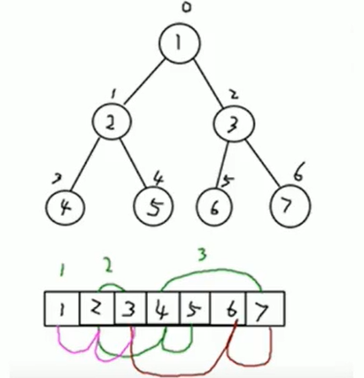
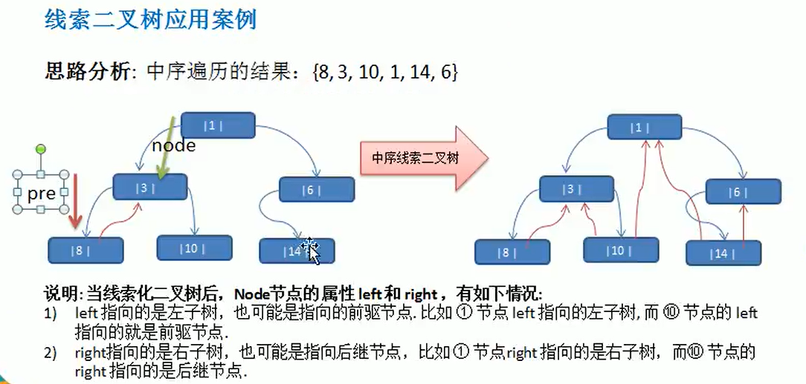

### 树

#### 二叉树

1. 树存储方式分析

   能提高存储，读取的效率，比如利用二叉排序树，既可以保证数据的检索速度，同时也可以保证数据的插入，删除，修改的速度。

2. 树的常用术语

   节点、根节点、父节点、子节点、叶子节点(没有子节点的节点)、节点的权(节点值)、路径(从root节点找到该节点的路线)、层、子树、树的高度(输的层数)、森林(多可子树构成森林)。

3. 二叉树

   - 每个节点最多有两个子节点。
   - 分为左子节点和右子节点。
   - 如果该二叉树的所有叶子节点都在最后一层，并且节点总数=2^n^-1,n为层数，为满二叉树。
   - 如果该二叉树的所有叶子节点都在最后一层或者倒数第二层，而且最后一层的叶子节点在左边连续，倒数第二层的叶子节点在右边连续，我们称为完全二叉树。
   - 二叉树遍历
     - 前序遍历：根左右
     - 中序遍历：左根右
     - 后序遍历：左右根
   
4. 顺序存储二叉树

   - 基本说明：从数据存储上来看，数组存储方式和树的存储方式可以相互转换，即数组可以转换为树，树也可以转换成数组

     

   - 特点：

     - 顺序二叉树通常只考虑完全二叉树。
     - 第n个元素的左子节点为2*n+1。
     - 第n个元素的右子节点为2*n+2。
     - 第n个元素的父节点为(n-1)/2。
     - n：表示二叉树中的第几个元素(按0开始编号)
   
   

​			

5. 线索二叉树

   1. 基本介绍
      - n个节点的二叉链表中含有n+1公式【2n-(n-1)=n+1】个空指针域。利用二叉链表中的空指针域，存放指向节点在某种遍历次序下的前驱和后继节点的指针(这种附加的指针称为“线索”)
      - 这种加上了线索的二叉链表称为线索链表，相应的二叉树称为线索二叉树(ThreadedBinaryTree)。根据线索性质的不同，线索二叉树可分为前序线索二叉树、中序线索二叉树和后序线索二叉树三种。
      - 一个节点的前一个节点，称为前驱节点
      - 一个节点的后一个节点，称为后驱节点
      
   2. 应用案例

      ​	