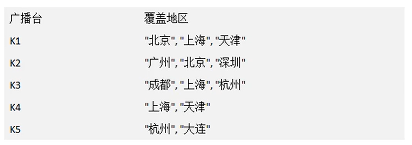

## 贪心算法

### 应用场景-集合覆盖问题

假设存在下面需要付费的的广播台，以及广播台信号可以覆盖的地区。如何选择最少的广播台，让所有的地区都可以接收到信号。



### 基本介绍

1. 贪心算法（贪婪算法）是指在对问题进行求解时，在每一步选择中都采取最好或最优的选择，从而希望能够导致结果是最好或者最优的算法。
2. 贪婪算法所得到的结果不一定是最优的结果（有时候会是最优解），但是都是相对接近（接近）最优解的结果

### 思路分析

1. 如何找到覆盖所有地区的广播台的集合呢，使用穷举法实现，列出每个可能的广播台的集合，这被称为幂集。假设总的有n个广播台，则广播台的组合总共有2^n^-1个，假设每秒可以计算10个子集，如图：

   

2. 开始：使用贪心算法，效率高

   目前没有算法可以快速计算得到准备的值，使用贪心算法，则可以得到非常接近的解，并且效率高，选择策略上，因为需要覆盖全部地区的最小集合：

   1. 便利所有的广播电台，找到一个覆盖了最多未覆盖的地区的电台（此电台可能包含一些已覆盖的地区，但没有关系）
   2. 将这个电台加入到一个集合中（比如Arraylist），想办法把该电台覆盖的地区在下次比较时去掉
   3. 重复第一步直到覆盖了全部地区

### 代码实现

```java
package greedy;

import java.util.ArrayList;
import java.util.HashMap;
import java.util.HashSet;
import java.util.Map;

//贪心算法，用最少的广播覆盖最大的范围
public class GreedyAlgorithm {
    public static void main(String[] args){
        //创建一个广播电台，放入到Map
        Map<String, HashSet<String>> broadcasts = new HashMap<>();

        //将每个电台放到broadcasts
        HashSet<String> hashSet1 = new HashSet<>();
        hashSet1.add("北京");
        hashSet1.add("上海");
        hashSet1.add("天津");

        HashSet<String> hashSet2 = new HashSet<>();
        hashSet2.add("广州");
        hashSet2.add("北京");
        hashSet2.add("深圳");

        HashSet<String> hashSet3 = new HashSet<>();
        hashSet3.add("成都");
        hashSet3.add("上海");
        hashSet3.add("杭州");

        HashSet<String> hashSet4 = new HashSet<>();
        hashSet4.add("上海");
        hashSet4.add("天津");

        HashSet<String> hashSet5 = new HashSet<>();
        hashSet5.add("杭州");
        hashSet5.add("大连");

        //加入到Map
        broadcasts.put("k1",hashSet1);
        broadcasts.put("k2",hashSet2);
        broadcasts.put("k3",hashSet3);
        broadcasts.put("k4",hashSet4);
        broadcasts.put("k5",hashSet5);
//        System.out.println(broadcasts);

        //全部地区
        HashSet<String> allAreas = new HashSet<>();
        allAreas.addAll(hashSet1);
        allAreas.addAll(hashSet2);
        allAreas.addAll(hashSet3);
        allAreas.addAll(hashSet4);
        allAreas.addAll(hashSet5);
//        System.out.println(allAreas);

        //创建ArrayList,存放选择的电台集合
        ArrayList<String> selects = new ArrayList<>();

        //定义一个临时集合，在遍历的过程中，存放遍历的电台覆盖的区域和当前还没有覆盖的区域的交集
        HashSet<String> tempSet = new HashSet<>();

        //定义maxKey,保存一次遍历，能够覆盖最大地区的电台key,若maxKey不为空，则添加到selects
        String maxKey = null;
        while (allAreas.size() != 0){

            maxKey = null;

            for (String key : broadcasts.keySet()) {
                tempSet .clear();
                //当前电台所覆盖的区域
                HashSet<String> areas = broadcasts.get(key);
                tempSet.addAll(areas);
                //取交集
                tempSet.retainAll(allAreas);
                //如果当前这个集合包含的未覆盖地区的数量，比maxKey指向的集合未覆盖的地区还多，重置maxKey
                //tempSet.size() > broadcasts.get(maxKey).size()体现出贪心算法的特点，每次选择最优
                if (tempSet.size() > 0 && (maxKey == null || tempSet.size() > broadcasts.get(maxKey).size())){
                    maxKey = key;
                }
            }

            //maxKey！=null，应将maxKey加入到selects
            if (maxKey != null){
                selects.add(maxKey);
                //将maxKey指向的广播电台覆盖的地区，从allAreas去掉
                allAreas.removeAll(broadcasts.get(maxKey));
            }
        }

        System.out.println("得到的选择结果是"+selects);

    }
}

```

