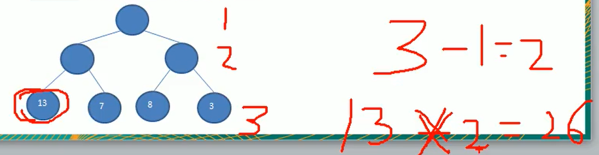
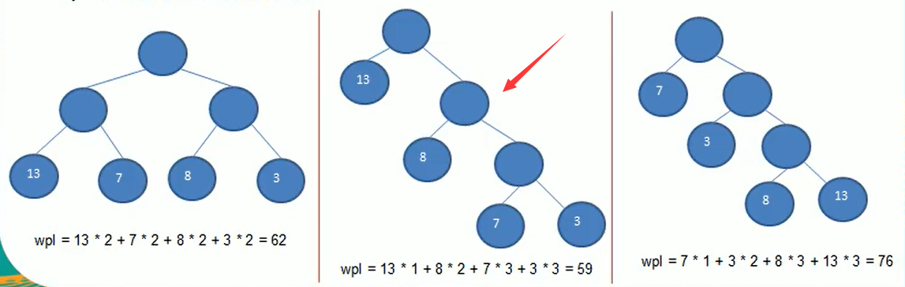
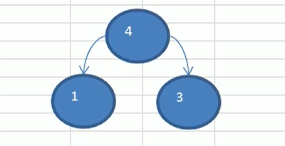
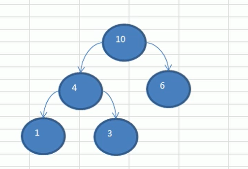
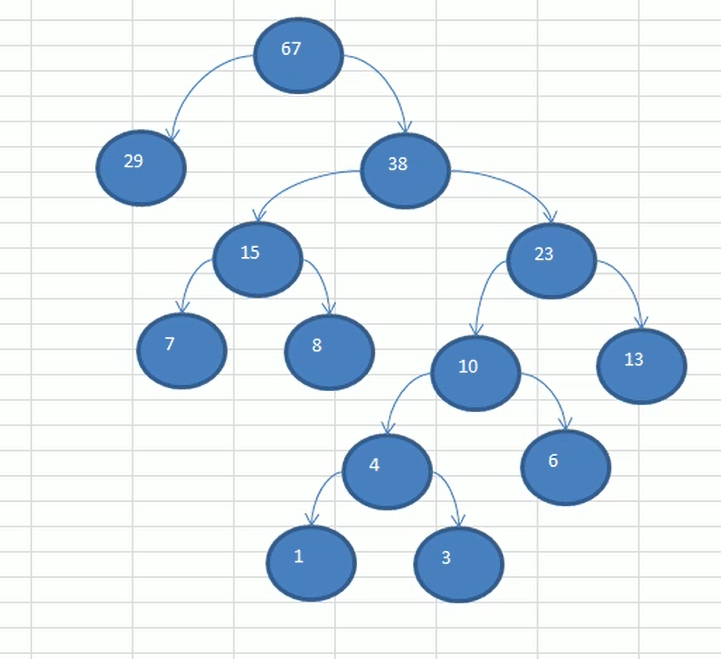
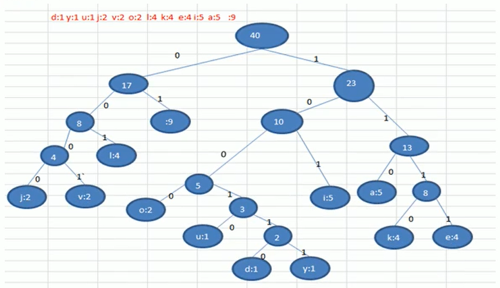
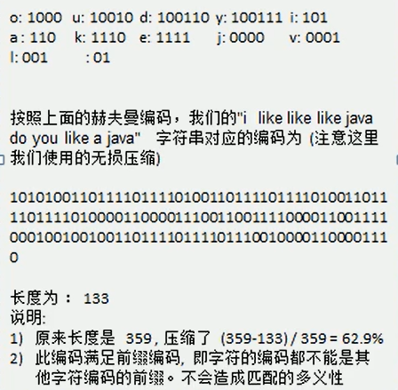
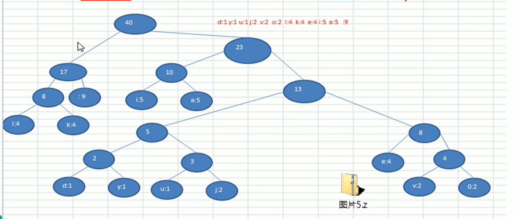

## 赫夫曼树

1. 基本介绍

   - 给定n个权值作为n个叶子结点，构造成一课二叉树，若该树的带权路径长度(wpl)达到最小，称这样的二叉树为最优二叉树，也称为哈夫曼树(HuffmanTree)，还有的书翻译为霍夫曼树。

   - 赫夫曼树是带权路径长度最短的树，权值较大的节点离根较近。

     ### 举例说明

   - 路径和路径长度：在一棵树中，从一个结点往下可以达到的孩子或孙子结点的通路，称为路径。通路中分支的数目称为路径长度。若规定根节点的层数为1，则从根节点到第L层节点的路径为L-1.

   - 节点的权及带权路径长度：若将树中节点赋给一个有着某种含义的数值，则这个数值称为该节点的权。节点的带权长度路径为：从根节点到该节点之间的路径长度与该节点的权的乘积。

     

   - 树的带权路径长度：树的带权路径长度规定为所有叶子节点的带权路径长度之和，记为WPL(weighted path length),权值越大的节点离根节点越近的树才是最优二叉树。

   - WPL最小的就是赫夫曼树。

     

2. 赫夫曼树创建思路图解

   给定一个数列{13,7,8,3,29,6,1},要求转成一个赫夫曼树

   思路分析(步骤)：

   1. 从小到大进行排序，将每一个数据，每个数据都是一个节点，每个节点可以看成是一颗最简单的二叉树
   2. 取出根节点权值最小的两颗二叉树
   3. 组成一颗新的二叉树，该新的二叉树的根节点的权值是前面两棵二叉树根节点权值的和。
   4. 再将这颗新的二叉树，以根节点的权值大小再次排序，不断重复1-2-3-4的步骤，直到数列中，所有的数据都被处理完，就得到一颗赫夫曼树。
   
   #### 图解
   
   1. 先排序，得到{1,3,6,7,8,13,29}
   
   2. 取出最小的两个权值，完成步骤2
   
      
   
   3. {4,6,7,8,13,29}，取出4,6
   
      
   
   4. {7,8,10,13,29}，取出7,8，父节点为15；排序{10,13,15,29}，取出10,13，父节点为23；排序{15,23,29}，取出15,23，父节点为38；排序{29,38}，取出29,38，父节点为67
   
      
   
   5. 赫夫曼树建立完成
   
   代码实现：
   
   ```java
   package huffmantree;
   
   import java.util.ArrayList;
   import java.util.Collections;
   import java.util.List;
   
   public class HuffmanTree {
       public static void main(String[] args){
           int []arr = {13,7,8,3,29,6,1};
           Node root = CreateHuffmanTree(arr);
           //前序遍历
           System.out.println("前序遍历");
           preOrder(root);
       }
   
       //编写一个前序遍历的方法
       public static void preOrder(Node root){
           if (root != null){
               root.preOrder();
           }else {
               System.out.println("是空树，不能遍历");
           }
       }
       //创建一个赫夫曼树
       public static Node CreateHuffmanTree(int []arr){
           //将数组转为node集合
           List<Node> nodes = new ArrayList<>();
           for (int value : arr) {
               nodes.add(new Node(value));
           }
           //循环处理
           while (nodes.size() > 1){
               Collections.sort(nodes);
   //        System.out.println(nodes);
               //取出根节点权值最小的两颗二叉树
               //(1)取出权值最小的节点
               Node leftNode = nodes.get(0);
               //(2)取出权值次小的节点
               Node rightNode = nodes.get(1);
               //(3)构建一棵新的二叉树
               Node parent = new Node(leftNode.value+ rightNode.value);
               parent.left = leftNode;
               parent.right = rightNode;
               //(4)从nodes中删除这两个节点
               nodes.remove(leftNode);
               nodes.remove(rightNode);
               //(5)将parent插入到nodes中
               nodes.add(parent);
           }
           return nodes.get(0);
       }
   }
   
   //利用Collections工具类中实现Comparable接口来进行排序
   class Node implements Comparable<Node>{
       int value;//节点的权值
       Node left;//左子节点
       Node right;//右子节点
   
       public Node(int value) {
           this.value = value;
       }
   
       @Override
       public String toString() {
           return "Node{" +
                   "value=" + value +
                   '}';
       }
   
       @Override
       public int compareTo(Node o) {
           return this.value - o.value;
       }
   
       //前序遍历
       public void preOrder(){
           System.out.println(this);
           if (this.left != null){
               this.left.preOrder();
           }
           if (this.right != null){
               this.right.preOrder();
           }
       }
   }
   
   ```
   
   
   
3. ### 赫夫曼编码

   1. 基本介绍

      1. 赫夫曼编码也翻译为哈夫曼编码(Huffman Coding)，又称霍夫曼编码，是一种编码方式，属于一种程序算法。
      2. 赫夫曼编码是哈夫曼树在电讯通信中的经典的应用之一。
      3. 赫夫曼编码广泛应用于数据文件压缩。其压缩率通常在20%-90%之间。
      4. 赫夫曼编码是可变长编码(VLC)的一种。Huffman于1952年提出一种编码方法，称之为最佳编码。

   2. 原理剖析

      1. 通信领域中信息的处理方式1-定长编码

         - 一串字符串(i like like like java do you like a java)，包含空格,40个字符
         - 对应的ASCII码
         - 对应的二进制，一个字节8位
         - 按照二进制传递信息，总长度为359
         - 在线转码工具，搜索

      2. 通信领域中信息的处理方式2-变长编码

         - 一串字符串(i like like like java do you like a java)，包含空格,40个字符
         - d:1 y:1 u:1 j:2 v:2 o:2 l:4 k:4 e:4 i:5 a:5  :9//各个字符对应的个数
         - 0= ，1=a,10=i,11=e,100=k,101=l,110=o,111=v,1000=j,1001=u,1010=y,1011=d，说明：按照各个字符出现的次数进行编码，原则是出现次数越多的，则编码越小，比如空格出现9次，编码为0，其它以此类推。
         - 按照上面给各个字符规定的编码，则我们在传输"i like like like java do you like a java"数据时，编码就是10010110100
         - 字符的编码都不能是其它字符编码的前缀，符合此要求的编码叫做前缀编码，即不能匹配到重复的编码(这个在赫夫曼编码中，我们进行举例说明)

      3. 构建

         

         - 根据赫夫曼树，给各个字符规定编码，向左的路径规定为0，向右的路径规定为1，编码如下：

         

      4. 注意

         这个赫夫曼树根据排序算法的不同，也可能不太一样，这样对应的赫夫曼编码也不完全一样，但是wpl是一样的，都是最小的，比如：如果我们让每次生成的新的二叉树总是排在权值相同的二叉树的最后一个，

         

   3. 数据压缩，根据赫夫曼编码压缩数据的原理，需要创建"i like like like java do you like a java"对应的赫夫曼树

      1. Node{data(存放数据)，weight(权重)，left，right}
      2. 得到"i like like like java do you like a java"对应的byte数组
      3. 编写一个方法，将准备构建赫夫曼树的Node节点放到List，形式[Node[data=97,weight=5],Node[data=32,weight=9]……]，体现：d:1 y:1 u:1 j:2 v:2 o:2 l:4 k:4 e:4 i:5 a:5
      4. 可以通过List创建赫夫曼树
      
   4. 数据解压：
   
      1. 将huffmanBytes数组转为二进制字符串
      2. 二进制字符串再对照赫夫曼编码表输出对应的原字符串