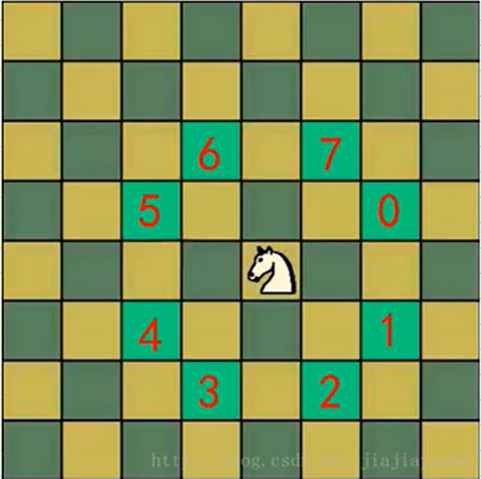

## 骑士周游问题

### 马踏棋盘算法

实际上是图的深度优先搜索（DFS）的应用

思路：

1. 创建棋盘chessBoard，8×8

2. 将当前这个位置设置成已经访问，然后根据当前位置，计算马儿还能走哪些位置，并放入到一个集合，最多有8个位置，每走一步，就使用step+1

3. 遍历集合所有位置，找到通路，走通继续，不通回溯

4. 使用step和应走的步数比较，若不相等，将整个棋盘置零

   注意，马儿不同的走法（策略），会得到不同的结果，影响效率（优化）
   
   
   
5. 使用贪心算法对原来的算法优化

   1. 我们获取当前位置可以走的下一个位置的集合

      ```java
      ArrayList<Point> points = next(new Point(column,row));
      ```

   2. 我们需要对points中所有的point进行非递减排序

      9,7,6,5,3,2,1//递减排序

      1,2,3,4,5,6,10//递增排序

      1,2,2,2,3,3,4,5,6//非递减排序

      9,7,6,6,5,5,3,2,1//非递增